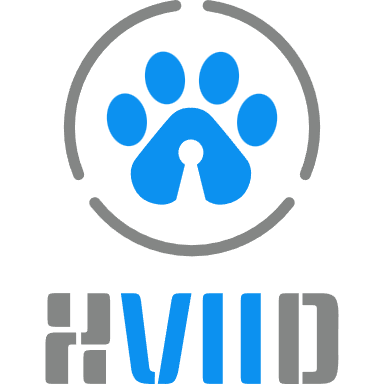
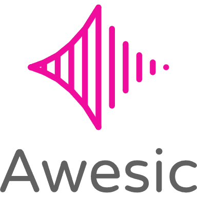
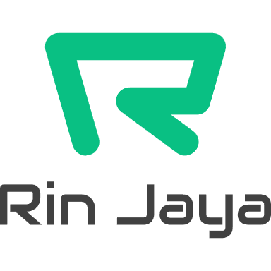
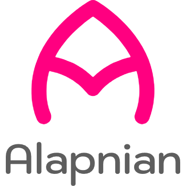

    &nbsp;
    

<h1>
    
    DYO WIRANATA MULYA 
    <small><small>CEO, Owner, Founder, Commissioner, Fullstack</small></small>
</h1>

    
    
    
    
    
    
    
    
    
    

 

<blockquote>Highly experienced CEO, Owner & Founder with a successful career spanning 5 years. Experienced in a variety of markets, including the public and private sectors. A proven track record of successfully leading companies to growth and profitability.</blockquote>

<h2>Skills</h2>

<h3>Languages</h3>

<table>
    <tr>
        <td><a target="_blank" href="https://en.wikipedia.org/wiki/Indonesian_language">Bahasa Indonesia</a></td>
        <td></td>
        <td><a target="_blank" href="https://en.wikipedia.org/wiki/English_language">English</a></td>
        <td></td>
    </tr>
    <tr>
        <td><a target="_blank" href="https://en.wikipedia.org/wiki/South_Barisan_Malay">Serawai</a></td>
        <td></td>
        <td><a target="_blank" href="https://en.wikipedia.org/wiki/Javanese_language">Javanese</a></td>
        <td></td>
    </tr>
</table>

<h3>Programming</h3>

<h3>Others</h3>

- [x] Leadership
- [x] Preacher
- [x] Strategic Planning
- [x] Management
- [x] Communication
- [x] Financial Acumen
- [x] Negotiation
- [x] Design

<h2>Educations</h2>

<table>
    <tr>
        <td align="center">
            
        </td>
        <td align="center">
             
            MAN 1 Indramayu
        </td>
        <td align="center">
            
        </td>
    </tr>
</table>

<h2>Experiences</h2>

<table>
    <tr>
        <td align="center"></td>
        <td>
            <dl>
                <dd>
                    Owner & Founder — <a target="_blank" href="https://xviid.com/">XVIID</a> 
                    2020 - Now
                </dd>
            </dl>
        </td>
    </tr>
    <tr>
        <td align="center"></td>
        <td>
            <dl>
                <dd>
                    CEO & Founder — <a target="_blank" href="https://awesic.com/">Awesic</a> 
                    2025 - Now
                </dd>
            </dl>
        </td>
    </tr>
    <tr>
        <td align="center"></td>
        <td>
            <dl>
                <dd>
                    Commissioner — <a target="_blank" href="https://gloogia.com/">Gloogia</a> 
                    2021 - Now
                </dd>
            </dl>
        </td>
    </tr>
    <tr>
        <td align="center"></td>
        <td>
            <dl>
                <dd>
                    Chief Technology Officer — <a targe="_blank" href="https://rinjaya.com/">Rin Jaya</a> 
                    2025 - Now
                </dd>
            </dl>
        </td>
    </tr>
    <tr>
        <td align="center"></td>
        <td>
            <dl>
                <dd>
                    Founder & Fullstack — <a target="_blank" href="https://alapnian.com/">Alapnian</a> 
                    2025 - Now
                </dd>
            </dl>
        </td>
    </tr>
    <tr>
        <td align="center"></td>
        <td>
            <dl>
                <dd>
                    Certified Student Internship Program Batch 1 2020 — <a target="_blank" href="https://timah.com/">PT Timah Tbk</a> 
                    2020
                </dd>
            </dl>
        </td>
    </tr>
</table>

<h2>Portfolio</h2>

<table>
    <tr>
        <td align="center"></td>
        <td>
            <strong>E-PKAP Indramayu</strong> 
            Web-based information system using the CodeIgniter framework. This system was created to help manage awards and administer disciplinary sanctions for all civil servants in Indramayu regency.  
            🏷 Project | 🗓 2021 | <a target="_blank" href="//e-pkapindramayu.page.gd" title="Demo">☍ simamat.page.gd</a>
        </td>
    </tr>
    <tr>
        <td align="center"></td>
        <td>
            <strong>Simamat (Sistem Informasi Magang Mahasiswa Timah)</strong> 
            Web-based information system using the CodeIgniter framework. This system was created to help monitor interns, manage intern absences, manage intern tasks, manage intern certificate assessments, and print intern identity cards automatically.  
            🏷 Project | 🗓 2024 | <a target="_blank" href="//simamat.page.gd" title="Demo">☍ simamat.page.gd</a>
        </td>
    </tr>
    <tr>
        <td align="center"></td>
        <td>
            <strong>CodeIgniter 4 Favicons</strong> 
            A codeigniter 4 library to generate favicons automatically.  
            🏷 Hobby | 🗓 2025 | <a target="_blank" href="//github.com/dyonmulya/codeigniter4-favicons" title="Repo">☍ github.com/dyonmulya/codeigniter4-favicons</a>
        </td>
    </tr>
    <tr>
        <td></td>
        <td></td>
    </tr>
</table>

    Diperbarui : 04 November 2025

